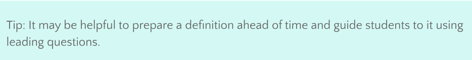

# Instructor’s notes
## What is an Algorithm?
Show the video [What exactly is an algorithm? Algorithms explained | BBC Ideas](https://youtu.be/ZnBF2GeAKbo)\
Invite students to reflect/debrief on the video:
1. Volunteer 1 thing they learned from the video
2. Volunteer 1 thing they already knew
3. What was their favorite part? Least favorite part?
## Word Wall
Introduce the idea of the Word Wall to the class. Make sure all students know how to access the Word Wall, and encourage them to contribute terms and definitions they come across throughout the class. Lead a class discussion to try and define the following terms. Display each term on the board or projector and ask students to provide key ideas or concepts they know that relate to the term. From this, develop a classroom definition. Some example definitions are included here:
- Computer: An electronic machine that can be programmed to solve problems, process data, store and retrieve data, and perform calculations.
- Computer Science: The study of the principles and use of computers.
- Algorithm: A complete, well-defined sequence of steps for completing a task or solving a problem.
- Computer Program: A sequence of instructions or steps—written in a language that can be understood by a computer—that will be used by the computer to complete a task or solve a problem.
- Programming Language: A vocabulary and set of grammatical rules for instructing a computer or computing device to perform specific tasks.

## Human Computers
Sidebar discussion you can choose to have when discussing the term “Computer”. Introduce the idea that the first computers were humans with the story of Katherine Johnson, whose calculations were used for manned and unmanned orbital missions (learn more). Optional to play the Hidden Figures movie trailer.
