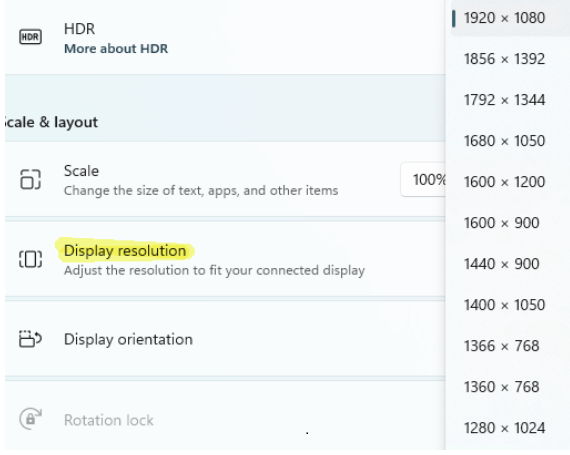

# Introduce the activity

- Remind students of the Cartesian coordinate system using the grid they have drawn from the bell ringer activity.
- Define the Origin and remind students that its location is (0,0).
- Explain that the coordinate system in MakeCode Arcade is different from the Cartesian coordinate system and that students will discover those differences in the activity.
- Explain that modern digital screens are measured in pixels, where the origin (0,0) is located in the upper left corner of the screen. You may even prompt students to look at the display resolution on their computer screens for a deeper understanding of how digital screens are measured. 

- Explain that a pixel is the smallest element of a picture that can be represented on a screen.
