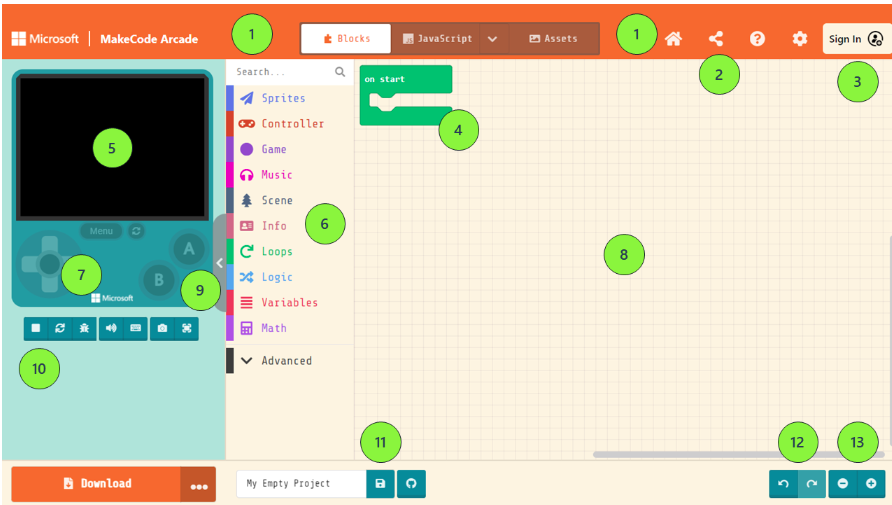

# Solutions

## Bell ringer

This is duplicated in the slide deck.

We have left the labels off this slide so that you can use it to review the Bell Ringer if you wish (e.g., “Which item is #8?”)

1. Home
(Yes, there are two “number ones” on the screen. They both do the same thing.)
2. Share
3. Login
4. on start container block
5. Simulator
6. Toolbox
7. Directional pad
8. Workspace
9. Show/hide simulator
10. Start/stop simulator
11. Save
12. Undo and redo
13. Workspace zoom controls

## Lab activity

Solutions for the scavenger hunts are available in the instructor resources for this course.
