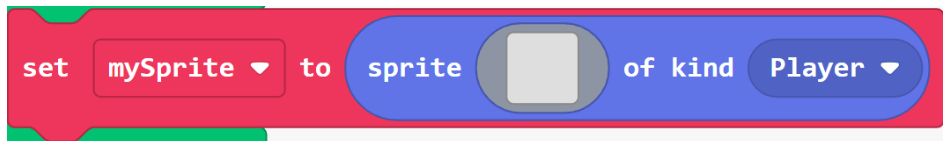
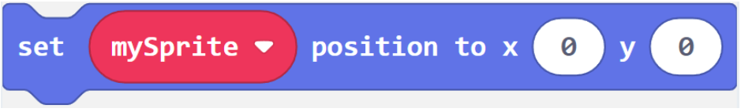
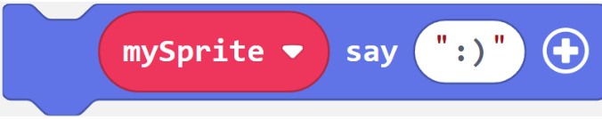

# Solutions

## Bell ringer

\
Creates a sprite with given image and kind.
\
\
\
Places a sprite at a particular location on the screen. Horizontal coordinate is x; vertical coordinate is y. Origin (0, 0) is the top-left corner of the screen. Horizontal coordinates are numbered from 0 to 159; vertical, from 0 to 119.
\
\
\
Allows the player to move a sprite with the joypad.
\
\
\
Displays a dialog bubble for a sprite with the given message. Long messages scroll.
\
\
\
Destroys a sprite. Clicking on the encircled plus sign expands the block to show additional options. Expanding the destroy block allows an effect to be used.

Applies an effect to a sprite. Clicking on the encircled minus sign collapses the block and sets the hidden parameters to their default values.

## Lab activity
Lab solutions are available in the instructor resources for this course.
