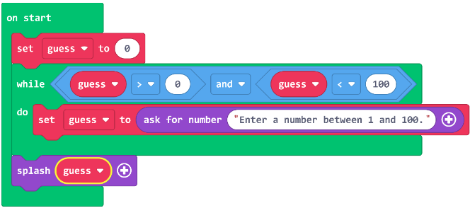

# Debrief

1. Jordan is working on a game where the player needs to enter a number between 1 and 100, but the code does not seem to be working correctly. What could be wrong with the code below?

Answer: Range criteria are easy to get wrong. Change the conditional to any of the following:
    - while guess < 1 or guess > 100
    - while guess <= 0 or guess >= 101
    - while not (guess > 0 and guess < 101)
    - while not (guess >= 1 and guess <= 100)
1. Create an example with a loop that never exits. (These are called infinite loops.)
Note that it says infinite loops, which is really similar to the term indefinite loops. \
They are not the same thing.\
Examples:\
    - Loops where the loop control variable is never modified (Example: while guess != 0, and then guess is never changed in the loop)
    - Loops where the exit condition can never be satisfied
(Example: while guess < 100 or guess > 0)
    - The forever loop
